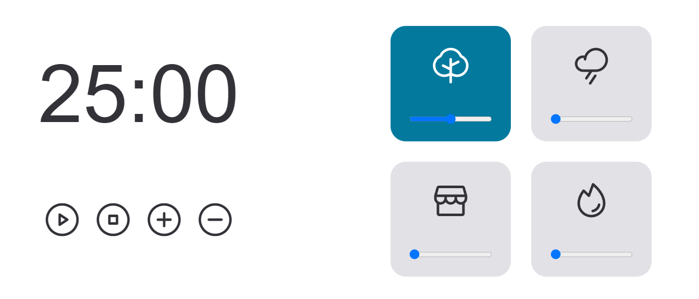

<h1 align="center"> Focus Timer </h1>

Projeto realizado como desafio para criação de Focus Timer, no qual o usuário pode além de usar o contador, escutar músicas relaxantes

## 🚀 Tecnologias
Esse projeto foi desenvolvido com as seguintes tecnologias:

- HTML
- CSS
- Git e Github
- Figma
- JavaScript

## 💻 Projeto

### Funcionalidades
- Iniciar
- Pausar
- Parar
- Ajustar
  - `+` adiciona 5 minutos
  - `-` retira 5 minutos
- Em cada card é possível selecionar sons ambiente para tocar 
  - `floresta`
  - `chuva`
  - `cafeteria`
  - `lareira`
- É possível ajustar o volume dos sons através do slider

O desafio foi proposto no curso Explorer da Rocketseat. A ideia é aplicar o que foi aprendido sobre vários temas:

- Responsividade
- Recursão de funções
- Clean Code
- Manipulação de aúdio

 
Desenvolvido por: Guilherme Damasceno

